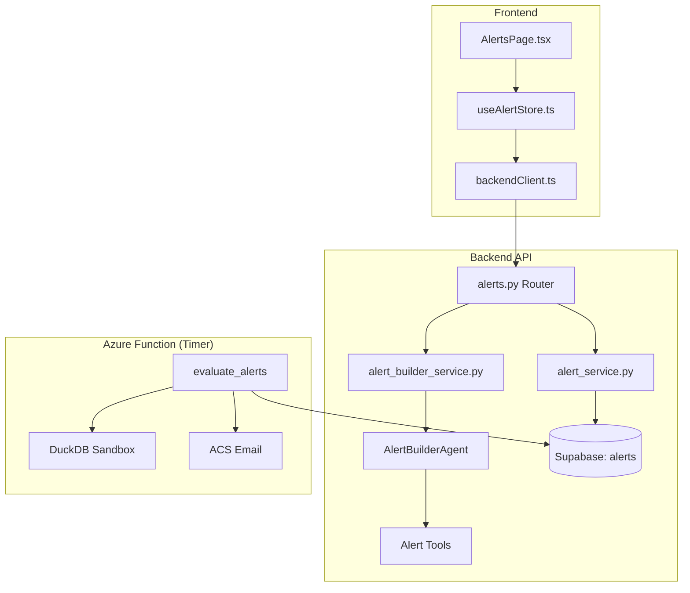

# Alerts Feature — Implementation Summary

> [!NOTE]
> Full implementation of the Data-Driven Alerts feature across all 5 layers: database, models, API, agent, evaluator, and frontend.

## Files Created / Modified

### Phase 1 — Foundations (Database + Models + Service + Router)

| File | Action | Description |
|------|--------|-------------|
| [7-create-alerts-tables.sql](file:///c:/Users/kris/Desktop/projects/git_repos/bi-agent-2.0/backend/supabase/queries/7-create-alerts-tables.sql) | **Created** | Supabase migration: `alerts`, `alert_runs`, `alert_notifications` tables with RLS, indexes, triggers |
| [alerts.py (models)](file:///c:/Users/kris/Desktop/projects/git_repos/bi-agent-2.0/backend/src/fastapi_app/models/alerts.py) | **Created** | Pydantic models: `AlertDefinition`, `AlertCreate`, `AlertUpdate`, `AlertOut`, `AlertRunOut`, enums |
| [alert_service.py](file:///c:/Users/kris/Desktop/projects/git_repos/bi-agent-2.0/backend/src/fastapi_app/services/alert_service.py) | **Created** | CRUD + test evaluation + run history service (mirrors `dashboard_service.py` patterns) |
| [alerts.py (router)](file:///c:/Users/kris/Desktop/projects/git_repos/bi-agent-2.0/backend/src/fastapi_app/routers/alerts.py) | **Created** | REST endpoints: CRUD, run history, test-eval, builder/stream SSE |
| [app.py](file:///c:/Users/kris/Desktop/projects/git_repos/bi-agent-2.0/backend/src/fastapi_app/app.py) | **Modified** | Registered alerts router + OpenAPI tag |
| [__init__.py (models)](file:///c:/Users/kris/Desktop/projects/git_repos/bi-agent-2.0/backend/src/fastapi_app/models/__init__.py) | **Modified** | Exported alert models from package |

### Phase 2 — Builder Agent (NL → Structured Alert)

| File | Action | Description |
|------|--------|-------------|
| [agents/alerts/__init__.py](file:///c:/Users/kris/Desktop/projects/git_repos/bi-agent-2.0/backend/src/ai/agents/alerts/__init__.py) | **Created** | Package init |
| [agents/alerts/prompts.py](file:///c:/Users/kris/Desktop/projects/git_repos/bi-agent-2.0/backend/src/ai/agents/alerts/prompts.py) | **Created** | System prompt guiding NL→alert definition workflow |
| [agents/alerts/tools.py](file:///c:/Users/kris/Desktop/projects/git_repos/bi-agent-2.0/backend/src/ai/agents/alerts/tools.py) | **Created** | `list_user_tables`, `inspect_columns`, `validate_metric_sql`, `propose_alert` |
| [agents/alerts/agent.py](file:///c:/Users/kris/Desktop/projects/git_repos/bi-agent-2.0/backend/src/ai/agents/alerts/agent.py) | **Created** | `AlertBuilderAgent` class (LangGraph agent) |
| [alert_builder_service.py](file:///c:/Users/kris/Desktop/projects/git_repos/bi-agent-2.0/backend/src/fastapi_app/services/alert_builder_service.py) | **Created** | SSE streaming service for builder agent (emits `alert_preview` events) |

### Phase 3 — Azure Function Evaluator

| File | Action | Description |
|------|--------|-------------|
| [host.json](file:///c:/Users/kris/Desktop/projects/git_repos/bi-agent-2.0/azure-function-alert-evaluator/host.json) | **Created** | Function app host config (10min timeout) |
| [local.settings.json.example](file:///c:/Users/kris/Desktop/projects/git_repos/bi-agent-2.0/azure-function-alert-evaluator/local.settings.json.example) | **Created** | Required env vars: Supabase, Azure Storage, ACS Email |
| [requirements.txt](file:///c:/Users/kris/Desktop/projects/git_repos/bi-agent-2.0/azure-function-alert-evaluator/requirements.txt) | **Created** | Python deps |
| [.funcignore](file:///c:/Users/kris/Desktop/projects/git_repos/bi-agent-2.0/azure-function-alert-evaluator/.funcignore) | **Created** | Deploy ignore patterns |
| [function.json](file:///c:/Users/kris/Desktop/projects/git_repos/bi-agent-2.0/azure-function-alert-evaluator/evaluate_alerts/function.json) | **Created** | Timer trigger binding (every 5 min) |
| [__init__.py](file:///c:/Users/kris/Desktop/projects/git_repos/bi-agent-2.0/azure-function-alert-evaluator/evaluate_alerts/__init__.py) | **Created** | Full evaluator: DuckDB sandbox, comparator logic, ACS email notifications |

### Phase 4 — Frontend

| File | Action | Description |
|------|--------|-------------|
| [useAlertStore.ts](file:///c:/Users/kris/Desktop/projects/git_repos/bi-agent-2.0/frontend/src/store/useAlertStore.ts) | **Created** | Zustand store: CRUD, optimistic toggle, runs, test evaluation |
| [AlertsPage.tsx](file:///c:/Users/kris/Desktop/projects/git_repos/bi-agent-2.0/frontend/src/components/AlertsPage.tsx) | **Created** | Full page: list + detail layout, status badges, run history, test, delete |
| [backendClient.ts](file:///c:/Users/kris/Desktop/projects/git_repos/bi-agent-2.0/frontend/src/services/backendClient.ts) | **Modified** | Added alert API methods (CRUD, runs, test, SSE builder stream) |
| [App.tsx](file:///c:/Users/kris/Desktop/projects/git_repos/bi-agent-2.0/frontend/src/App.tsx) | **Modified** | Replaced "COMING SOON" stub with `AlertsPage`, added import + topbar subtitle |
| [index.css](file:///c:/Users/kris/Desktop/projects/git_repos/bi-agent-2.0/frontend/src/index.css) | **Modified** | Added 300+ lines of alerts UI CSS matching existing dark SaaS theme |

---

## Architecture Overview

## API Endpoints

| Method | Path | Description |
|--------|------|-------------|
| `POST` | `/api/alerts` | Create alert |
| `GET` | `/api/alerts` | List user's alerts |
| `GET` | `/api/alerts/{id}` | Get single alert |
| `PATCH` | `/api/alerts/{id}` | Update alert (name, freq, enabled, target) |
| `DELETE` | `/api/alerts/{id}` | Delete alert + cascading |
| `GET` | `/api/alerts/{id}/runs` | Run history |
| `POST` | `/api/alerts/{id}/test` | Synchronous test evaluation |
| `POST` | `/api/alerts/builder/stream` | SSE: NL → AlertDefinition |

## Next Steps

> [!IMPORTANT]
> Before running in production:

1. **Run the migration** — Execute `7-create-alerts-tables.sql` in Supabase SQL Editor
2. **Deploy the evaluator** — `func azure functionapp publish <app-name>` for `azure-function-alert-evaluator/`
3. **Configure env vars** — Set `ACS_CONNECTION_STRING` and `ALERT_EMAIL_SENDER` for email delivery
4. **Test the agent** — Verify the `langchain.agents.create_agent` import resolves with your installed version (may need `create_react_agent` depending on langchain version)
